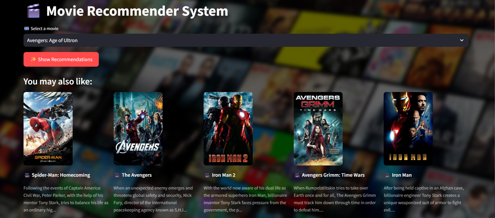

## Overview:
This project is a Movie Recommendation System built using Python and Streamlit (or your framework). The system recommends movies based on content similarity, genres, and other features. Users can search for their favorite movies and receive personalized recommendations.

## Features

Search Movies: Find movies by title.

Content-Based Recommendations: Suggests similar movies based on features like genre, director, cast, etc.

Genre Filtering: Filter movies by specific genres.

User-Friendly Interface: Simple and interactive UI built with Streamlit.

Scalable Dataset: Supports large movie datasets for recommendations.

## Dataset

The project uses a CSV file containing movie metadata such as:
Movie Name
Genre
Director
Year of Release
IMDb Rating

Example: movies_dataset.csv

## Technologies Used

Python,
Streamlit (or Flask/Tkinter if applicable),
Pandas,
scikit-learn (for TF-IDF and cosine similarity),
NumPy.

## Installation

**Clone the repository:** 
'''bash
git clone https://github.com/asif-3/movie-recommendation-system.git
'''

**Navigate to the project directory:**
'''bash
cd movie-recommendation-system
'''

**Install dependencies:** 
'''bash
pip install -r requirements.txt
'''

## Run the app

streamlit run app.py
Usage
Open the app in your browser.
Search for a movie you like.
View recommended movies based on your selection.
Optionally, filter results by genre or rating.

**Author**

**Mohamed Asif**

GitHub: https://github.com/asif-3

Email: mohamedasif1437@gmail.com
